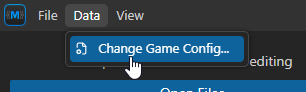
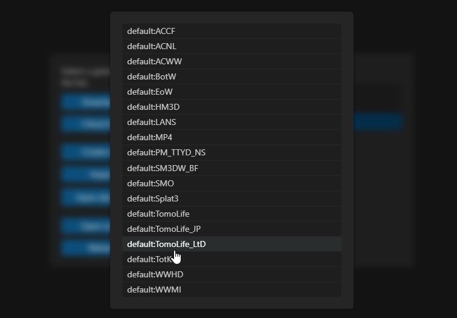
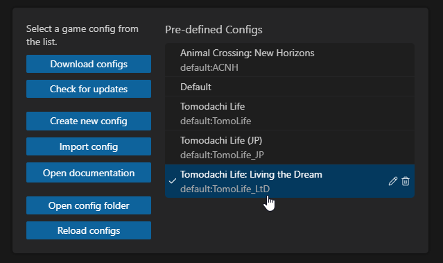

import { Steps, Tabs, TabItem } from '@astrojs/starlight/components';

**MSBT (Message Binary Text)** files are used in all Tomodachi Life games to store text data, such as interface, dialogue, items, and other in-game text. 

In this guide you will learn how to install and setup **MSBT Editor** and how to use it to modify your files. This guide is available for multiple Tomodachi Life games, please select the desired game on each section!

<Tabs>
  <TabItem label="Tomodachi Life: Living the Dream">
  In **Tomodachi Life: Living the Dream**, these files are stored inside a `.sarc.zs` file in the `romfs/Mals` folder and are named as `{language}.{type}.{version}.sarc.zs`, where:
  - `{language}` is the [Language Code](#language-codes)
  - `{type}` is either `Trial` (if is the **Demo** version) or `Product` (full game)
  - `{version}` is the game version (3rd line in `romfs/System/RegionLangMask.txt`) 
  </TabItem>
  <TabItem label="Tomodachi Life (3DS)">
  In **Tomodachi Life (3DS)**, these files are store inside `.bin` files in the `romfs/message` folder, being organized in folders. There is only one language per ROM, so you'll only find the language for the ROM you dumped.
  </TabItem>
</Tabs>

## Installing MSBT Editor
**[MSBT Editor](/tools/msbt-editor)** is the primary tool used to editing MSBT files. As it is the most feature-complete and user-friendly tool, also supports a ton of games. 

<Steps>
1. [Install MSBT Editor](https://msbt-editor.aeonsake.com/#download) and open it.
2. Locate and click on the `Data` drop-down menu (at the very top) and on `Change Game Config`.

    
3. Click on `Download Configs` and select the desired game(s).
    - `default:TomoLife_LtD` for **Tomodachi Life: Living the Dream**
    - `default:TomoLife` for **Tomodachi Life (3ds)**
    - `default:TomoLife_JP` for **Tomodachi Life (3ds) (Japanese Version)**
    

4. After downloading your desired game(s), go back to the previous screen and select the game you want to edit.

    
5. Your editor should be ready to use!
</Steps>

## Editing

<Tabs>
  <TabItem label="Tomodachi Life: Living the Dream">
    To edit messages is **really** simple, all you will need to do is localize your [language](#language-codes) in the `romfs/Mals` folder and open in the editor, here is a step by step:

    <Steps>
    1. Open MSBT Editor.
    2. Go to `File` > `Open File...` and select the desired language in your `rofms/Mals` folder.
        
        *You can also open the Mals folder directly, if you plan to edit multiples languages at the same time.*
    3. Expand the loaded file and find which **.MSBT** you want to edit.
    4. Do your edits and save the file with **Ctrl + S**.
    5. After finishing all yours edits, right click the *.sarc* file (the root file) and click on `Save`.
    6. You have successfully edited your texts!
    </Steps>
  </TabItem>
  <TabItem label="Tomodachi Life (3DS)">
    To edit messages is **really** simple, all you will need to do is open your `romfs/message` folder and open in the editor, here is a step by step:

    <Steps>
    1. Open MSBT Editor.
    
    2. Go to `File` > `Open Folder...` and select your `rofms/message` folder.
    3. Look for for the files you want to edit in the loaded directories and files.
    4. Do your edits and save the file with **Ctrl + S**.
    5. After finishing all yours edits, right click the `message` folder and click on `Save`.
    6. You have successfully edited your texts!
    </Steps>
  </TabItem>
</Tabs>

## References

### Language Codes
| Language               | Code |
| ---------------------- | ---- |
| Canadian French        | USfr |
| Latin American Spanish | USes |
| North American English | USen |
| Traditional Chinese    | TWzh |
| Korean                 | KRko |
| Japanese               | JPja |
| Dutch                  | EUnl |
| Italian                | EUit |
| European French        | EUfr |
| European Spanish       | EUes |
| European English       | EUen |
| German                 | EUde |
| Simplified Chinese     | CNzh |