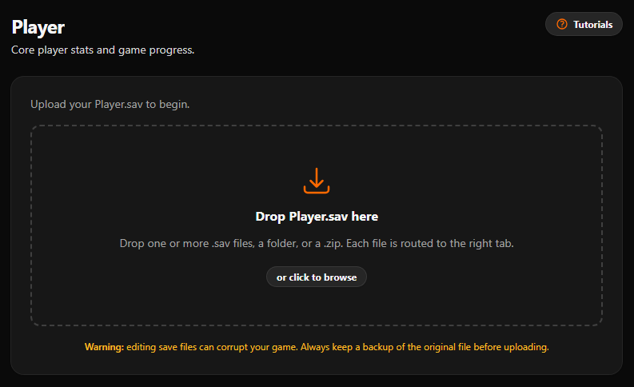
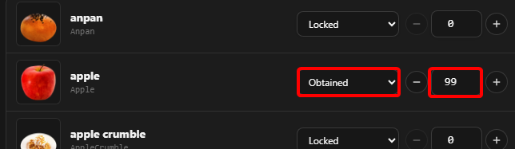
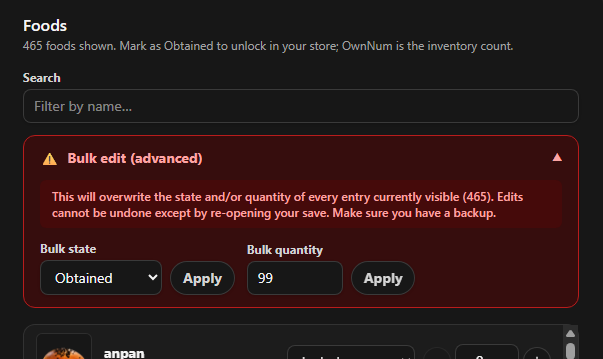

import { LinkCard, TabItem, Tabs } from '@astrojs/starlight/components';

The **Save Editor** is a tool that allows you to edit your save file for **Tomodachi Life: Living the Dream**, giving you the ability to change various aspects of your game, such as giving you items, money or even changing some more advanced data.

<LinkCard
  title="Access the Save Editor"
  href="https://ltdsave.app/"
  target="_blank"
  description="Opens the Save Editor on a new tab"/>

## How to use the Save Editor

On *Living the Dream*, you can access the Save Editor directly from your browser by either visiting [ltdsave.app](https://ltdsave.app/) or clicking on the button above. 

:::caution
Before continuing, please make sure to **backup your save file** before using the Save Editor, as there is always a risk of corrupting your save file when editing it.
:::

Once you open the Save Editor, you will be asked to upload your save file, you can either **upload one of the three save files** from your game or **upload the entire save folder**. After uploading your save file, you will see a simple interface with various tabs that allow you to edit different aspects of your save file.

## Player Tab

In the **Player** tab, there are various sub-tabs that allow you to edit different aspects of your player data.

### Profile

You can edit various aspects of your profile, such as your name, island name, skin tone, island size, money and more.

### Items

There are 6 sub-tabs in the **Player** tab that allow you to edit the items in your inventory, these are:
- **Foods**: You can edit the foods in your inventory.
- **Clothes**: You can edit the clothes in your inventory.
- **Clothing Sets**: You can edit the clothing sets in your inventory. 
- **Treasures**: You can edit the treasures in your inventory.
- **Interiors**: You can edit the interiors in your inventory.
- **Buildings**: You can edit the buildings in your inventory.

To unlock an item, simply change the state from `Locked` to `Obtained` and to edit the quantity, simply change the number next to the `Obtained` state.

*For example, if you want to have 99 Apples, simply change state from `Locked` to `Obtained` and change the quantity to `99`, as shown in the image below.*

##### Bulk Editing

You can also expand the bulk editing options by clicking on the `Bulk Edit`, this will allow you to edit the state and quantities of all items at once, as shown in the image below.

Simply set the state to `Obtained` and the quantity that you want for all items and click on both **Apply** buttons.

### UGC

In the **UGC** sub-tab, you can edit existining Lingos or create new ones by clicking on `+ Add Slot`.

### Advanced

The **Advanced** sub-tab allows you to edit any entry in your save file, this is recommended for advanced users only, as changing some values can cause issues with your save file.

:::danger
Editing values in the Advanced tab can permanently corrupt your save, brick your progress, or cause the game to crash or refuse to load.

**Always make a backup of your save file** before making any changes in the Advanced tab, and only change values that you are sure about.
:::