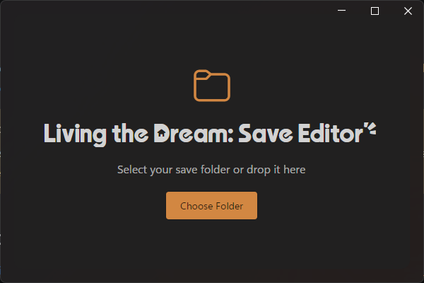
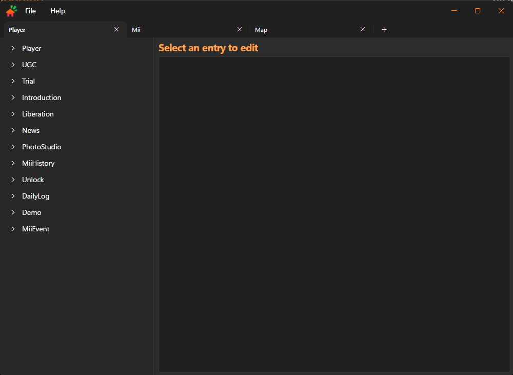

import { LinkCard, TabItem, Tabs } from '@astrojs/starlight/components';

The Save Editor is a tool that allows you to edit your save file for **Tomodachi Life: Living the Dream**, giving you the ability to change various aspects of your game, such as give you items, money or even change some more advanced data.


## Downloads

The Save Editor can be found on [GitHub](https://github.com/tlmodding/living-the-dream-save-editor), it is available for Windows on both WinForms and Avalonia and for Mac and Linux with Avalonia.

<Tabs>
  <TabItem label="Avalonia">
    Avalonia is a modern UI framework that can run nativelly on Windows, Linux and Mac. But it does requires **.NET 10 Runtime**.

    <LinkCard
      title="Windows x64"
      target="_blank"
      href="https://github.com/tlmodding/living-the-dream-save-editor/releases/latest/download/LTDSaveEditor-Windows-x64.zip"
    />

    <LinkCard
      title="Linux x64"
      target="_blank"
      href="https://github.com/tlmodding/living-the-dream-save-editor/releases/latest/download/LTDSaveEditor-Linux-x64.zip"
    />

    <LinkCard
      title="MacOS x64"
      target="_blank"
      href="https://github.com/tlmodding/living-the-dream-save-editor/releases/latest/download/LTDSaveEditor-macOS-x64.zip"
    />

    <LinkCard
      title="MacOS arm64"
      target="_blank"
      href="https://github.com/tlmodding/living-the-dream-save-editor/releases/latest/download/LTDSaveEditor-macOS-arm64.zip"
    />

    ### How to open
    <Tabs>
      <TabItem label="Windows">
      On Windows, just extract the files to a folder of your choice and open the `.exe` (either `LTDSaveEditor.Avalonia.exe` or `LTDSaveEditor.WinForms.exe`)
      </TabItem>

      <TabItem label="MacOS">
      After extracting your files, open your terminal in the extracted folder (right-click inside the folder, select **Services** and choose **New Terminal at Folder**) and use the following commands:
      ```sh 
      # Make the Avalonia executable, only required the first time
      chmod +x LTDSaveEditor.Avalonia 
      # Run it (you need to use this command every time you want to open it)
      ./LTDSaveEditor.Avalonia 
      ``` 
      </TabItem>

      <TabItem label="Linux">
      Open your terminal, navigate to the folder where you extracted the files and use the following commands:
      ```sh 
      # Make the Avalonia executable, only required the first time
      chmod +x ./LTDSaveEditor.Avalonia 
      # Run it (you need to use this command every time you want to open it)
      ./LTDSaveEditor.Avalonia 
      ``` 
      </TabItem>
    </Tabs>
  </TabItem>
  <TabItem label="WinForms">
    :::caution[Dependency]
    For non self-contained versions, you'll need to have [.NET 10 Runtime](https://dotnet.microsoft.com/download/dotnet/10.0) installed on your PC. It is available for Windows, Linux and Mac.
    :::

    WinForms is a UI Framework that targets Windows, but can be used on Mac and Linux with **[Wine](https://www.winehq.org/)**

    <LinkCard
      title="Windows WinForms (self-contained)"
      description="Self-contained apps don't require .NET 10 to be installed, but have a bigger download size."
      target="_blank"
      href="https://github.com/tlmodding/living-the-dream-save-editor/releases/latest/download/LTDSaveEditor-Windows-selfcontained.zip"
    />

    <LinkCard
      title="Windows WinForms"
      target="_blank"
      href="https://github.com/tlmodding/living-the-dream-save-editor/releases/latest/download/LTDSaveEditor-Windows.zip"
    />
  </TabItem>
</Tabs>

## How to use

To start using the Save Editor is pretty simple, all you'll need is your `.sav` files that can be extracted using **JKSV Save Manager** on Switch or by right-clicking the game on a emulator and using "Open User Save Directory".

In the case of an emulator, you can either copy these files to a folder of your preference or select the emulator folder directly, since Save Editor will backup your files automatically.

This is what you'll see when you open the program:


Simply drag and drop the folder directly into the editor or click the "Choose Folder" to select where your save files are.

And if you selected the folder correctly, you should be able to see the next window.
**NOTE:** The folder you select **must** contain all the required `.sav` files: `Player.sav`,`Mii.sav` and `Map.sav`



Now all you need is to select which entry/flag you want to edit. Let's see some examples.

## Examples
This is where things starts to get interesting, but can be a little hard to find all the options you want, so let's address some of the most important ones.

The examples in here will use dots to indicate a path, so to found the property just go on the tab (Player, Mii or Map) and start to un-collapse the dropdowns as the name suggests.

### Player
The `Player` tab stores all sort of information about the player itself, some of the most common flags are these:

- `Player.Money` - Stores the information of how much money your player have.

- `Trial.IsFinishedPR` (*demo only*) - Indicates if the player completed the demo.

### Unlocking Foods

In the **Player** tab, the `Player.FoodIndo.State` is where the foods states are stored, you can use the bulk edit option at the top right to change all entries at once or change values individually.

Changing the entries to `Obtained` will make them appear on your store so you can buy.

Alternatively, in `Player.FoodInfo.OwnNum` you can set the quantity you own for a specific food item (or bulk edit).

:::note
If the entries don't update after using Bulk Edit, just select another entry and go back to the one you edited, and it should update properly, it's a visual glitch.
:::

### Unlocking Clothes

In the **Player** tab, the `Player.ClothInfo.OwnInfoArray.State` is where the clothes states are stored, you can use the bulk edit option at the top right to change all entries at once or change values individually.

Changing the entries to `Obtained` will make them appear on your store so you can buy.

Alternatively, in `Player.ClothInfo.OwnInfoArray.OwnNum` you can set the quantity you own for a specific cloth (or bulk edit).

:::note
If the entries don't update after using Bulk Edit, just select another entry and go back to the one you edited, and it should update properly, it's a visual glitch.
:::

### Miis
The `Mii` tab stores all sort of information of your Miis, these can be useful for you:

First is important to know the **index** of the Mii you want to edit, to do this go on:

`Mii.Name.Name` - The first column is the index and second column is the name of your Mii, remember the index for the Mii you want to edit.

Now that you have the Mii index you can edit a lot of things like:

- `Mii.CharacterParam` - This group stores the *Sociability*, *Audaciousness*, *Activeness*, *Commonsense* and *Gaiety* of each Mii.
- `Mii.Feeling.Type` - Stores how the Mii is currently feeling.
- `Mii.MiiMisc.EatInfo.EatFullness` - Indicates how full the Mii stomatch is, from 0 to 100.
- `Mii.MiiMisc.EatInfo.UltraBestId` - The all-time favorite food of the Mii.
- `Mii.MiiMisc.EatInfo.BestId` - The 2nd all-time favorite food of the Mii.
- `Mii.MiiMisc.EatInfo.UltraWorstId` - The all-time hated food of the Mii.
- `Mii.MiiMisc.EatInfo.WorstId` - The 2nd all-time hated food of the Mii.